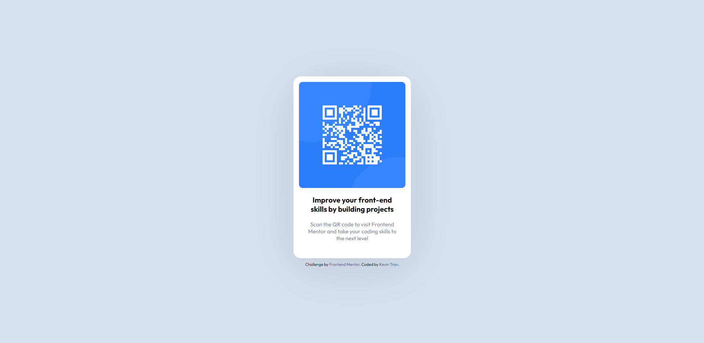

# Frontend Mentor - QR code component solution

This is a solution to the [QR code component challenge on Frontend Mentor](https://www.frontendmentor.io/challenges/qr-code-component-iux_sIO_H). Frontend Mentor challenges help you improve your coding skills by building realistic projects. 

## Table of contents

- [Overview](#overview)
  - [Screenshot](#screenshot)
  - [Links](#links)
- [My process](#my-process)
  - [Built with](#built-with)
  - [What I learned](#what-i-learned)
  - [Continued development](#continued-development)
  - [Useful resources](#useful-resources)
- [Author](#author)

## Overview

### Screenshot

### Links

- Solution URL: https://github.com/blanKTcup/qr-code-component-main
- Live Site URL: [https://blanktcup.github.io/qr-code-component-main/](https://660f0c7e6a8f6d0008f5f460--blanktcup-qr-code-component-main.netlify.app/)

## My process

### Built with

- Semantic HTML5 markup
- CSS custom properties
- Flexbox
- SASS/SCSS

### What I learned

The majority of my learnings came from working with SASS. I learned more about how to implement SASS scripts and get everything working nicely. I had to figure out that the my dev environment src/index.html needed to link to css/style.css because, when deployed, the public/index.html would need to link accordingly. This was interesting for my head to wrap around but utimately made a lot of sense due to the separate folders and nesting of files. I also learned what .gitignore does and why it's useful.  

### Continued development

I want to continue learning more about SASS and BEM. Both of these systems make CSS development very smooth and I want to feel confident that I really do understand what I am doing.

### Useful resources

- [Kevin Powell SASS video](https://www.youtube.com/watch?v=o4cECvhrBo8&pp=ygURa2V2aW4gcG93ZWxsIHNhc3M%3D) - This helped me understand SASS scripts more and how to correctly implement them.

## Author

- Frontend Mentor - [@blanKTcup](https://www.frontendmentor.io/profile/blanKTcup)
